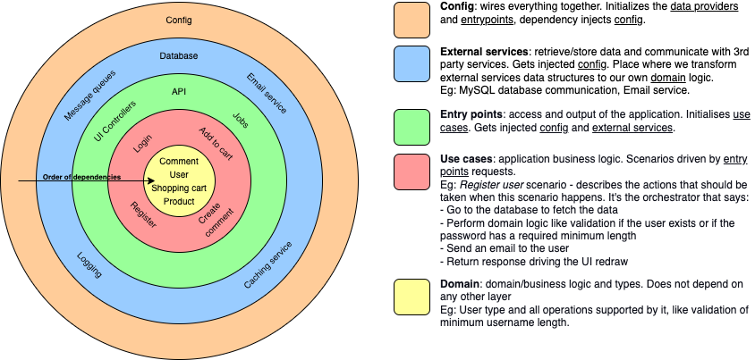

# Clean architecture example

-   Example web server application implementing the Clean architecture concepts
-   API spec is from https://www.todobackend.com/
-   Technology
    -   Language: TypeScript
    -   Database: SQLite (in memory)
    -   Web server: Koa

## My current understanding of the Clean architecture

## Problems/Questions

-   Is `TodoWithoutId` really entity (core business type) or should it be higher, like in use-cases (it is need in use-cases but it does not feel like it belongs there)?
-   There is import of types from outer layers to inner ones.
    -   For example `3-use-case/todos` imports `1-data-providers/storage` which is violation of the rule that dependencies flow only inward. The dependency itself flows inward (the storage is dependency injected) byt the type definition import violates this.
-   Since `1-data-providers` can be also communication with 3rd party services that do not provide data, eg send email service, maybe this should be named differently?
-   What about logger? Currently it is in `1-data-providers` so it can be used by other `1-data-providers` but it is not really providing data or communicate with external service, it seems to fit more into `2-entry-point` since it is kind of empty entry point with output (console) type of thing, but we cannot move it there (to `2-entry-point`) since logger needs to be dependency injected into other `1-data-providers`. Maybe renaming `1-data-providers` could also solve this.

## Remaining work

-   Maybe Zod validation errors should not get returned directly by API in `additionalData` but transformed to out own data type in api-ports?
    -   wrap zod errors and convert them to our own app errors?
-   Maybe add more than one thing in the use-case, something like dummy email service? So we have more than one of each in the use case?

## Nice to have

-   make sure every response is JSON based
    -   400 JSON parse error response is a text
    -   404 response is a text
    -   500 response is a text
-   add tests

## Related links

-   https://blog.cleancoder.com/uncle-bob/2012/08/13/the-clean-architecture.html
-   https://bazaglia.com/clean-architecture-with-typescript-ddd-onion/
-   https://dev.to/bespoyasov/clean-architecture-on-frontend-4311
-   https://herbertograca.com/2017/11/16/explicit-architecture-01-ddd-hexagonal-onion-clean-cqrs-how-i-put-it-all-together/
-   https://www.freecodecamp.org/news/a-quick-introduction-to-clean-architecture-990c014448d2/
-   https://github.com/mattia-battiston/clean-architecture-example
